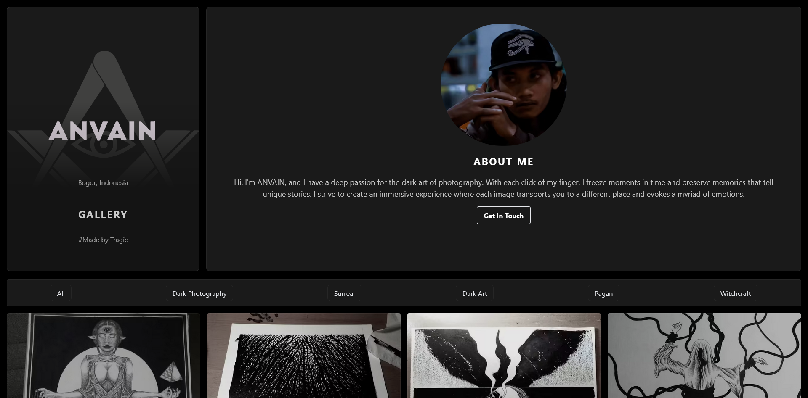

<div align="center">
  
</div>

###

<h3 align="left">Connect with me:</h3>
<p align="left">
<a href="https://twitter.com/romanromannya" target="blank"></a>
<a href="https://instagram.com/romanroman.nya" target="blank"></a>
<a href="https://www.youtube.com/c/lrmn_vp" target="blank"></a>
<a href="https://discord.gg/WFfjrQxnfH" target="blank"></a>
</p>

###

<h1 align="center">hey there 👋</h1>

###

<div align="center">
  
</div>

###

 <h3 align="left">👩‍💻  About Me </h3>
 <h4 align="left">I'm L RMN from my mom<br><br> 🔭 I’m working with PC<br> ⚡ In my free time I sleep<br>💔 love has a cost, and both of us lost</p></h4>

###

<h3 align="left"> What i'am listening to </h3>


###

# Cloudinary Dark Art Photography

This template is a plug and play image gallery portfolio site using Next.js, [Cloudinary](https://cloudinary.com), and [Tailwind](https://tailwindcss.com).


## Take A Look!



## Installation

Follow these steps to install and set up the Template on your local machine:

Clone the repository:  

`git clone https://github.com/lrmn7/anvain-seth.git` . 
  
Install Dependencies:  
  
`npm i` **or** `npm install`
  
Create dotenv file with the following lines:
  
`NEXT_PUBLIC_CLOUDINARY_CLOUD_NAME=yourcloudinarycloudname`
  
`CLOUDINARY_API_KEY=yourcloudinaryapikey` 
    
`CLOUDINARY_API_SECRET=yourcloudinaryapisecret`
  
Run on your local machine:
  
`npm run dev`

This will ensure the app will run with any new Cloudinary account. Please follow the steps below to view how to customize further.

## Cloudinary Setup 

Switching these folder paths will ensure that you can connect your own folders and images.  

```js
export async function getStaticProps() {
  const results = await cloudinary.v2.search
    .expression(`folder:samples/*`) // select folder that holds ALL images
    .sort_by("public_id", "desc")
    .max_results(400)
    .execute();
  let reducedResults: ImageProps[] = [];

  let i = 0;
  for (let result of results.resources) {
    reducedResults.push({
      id: i,
      height: result.height,
      width: result.width,
      public_id: result.public_id,
      format: result.format,
    });
    i++;
  }

```

 
```js

  const fetchImagesByCategory = async (category: string) => {
    try {
      const res = await fetch(
        `/api/images?folder=samples/${encodeURIComponent(category)}` // Do the same here.
      );
```  

Lastly, Make sure to switch out the categories in the Filter component. Keep in mind when creating your folders that it is case sensitive.  


```js
<Filter
          categories={[
            "Dark Photography",
            "Surreal",
            "Dark Art",
            "Pagan",
            "Witchcraft",
          ]}
          onCategorySelect={handleCategorySelect}
        />
```

## What I Learned

### Next.js
 In this project, it was used to create a seamless user interface that provides an optimal experience across a wide variety of devices. It allowed for both client-side and server-side data fetching, ensuring that the images load quickly and efficiently.

### Cloudinary
 In this project, it was used to store, optimize, and deliver images for the portfolio. Cloudinary's API allowed for quick and easy fetching of images and its manipulation features were used to ensure the images are displayed in the optimal size and format.

### TailwindCSS
 For this project, TailwindCSS was used to create a modern and responsive UI. Its utility-first nature made it incredibly easy to customize the portfolio's design and create a unique look and feel.

### Imagemin
Imagemin is a module to minify images. It was used in this project to compress the images before they were uploaded to Cloudinary. This step ensured that the image files were as small as possible without losing quality, which helped improve the site's performance.

### TypeScript
 It was used in this project to ensure type safety and improve tooling. It made the code more readable and maintainable.

## References

- [Next.js Documentation](https://nextjs.org/docs)
- [Cloudinary API Documentation](https://cloudinary.com/documentation/transformation_reference)
- [TailwindCSS Documentation](https://tailwindcss.com/docs)
- [Imagemin on GitHub](https://github.com/imagemin/imagemin)
- [TypeScript Documentation](https://www.typescriptlang.org/docs/)


## Learn More

To learn more about Next.js, take a look at the following resources:

- [Learn Next.js](https://nextjs.org/learn) - an interactive Next.js tutorial.

You can check out [the Next.js GitHub repository](https://github.com/vercel/next.js/) - your feedback and contributions are welcome!

## Deployed on Vercel

The easiest way to deploy your Next.js app is to use the [Vercel Platform](https://vercel.com/new?utm_medium=default-template&filter=next.js&utm_source=create-next-app&utm_campaign=create-next-app-readme) from the creators of Next.js.

Check out our [Next.js deployment documentation](https://nextjs.org/docs/deployment) for more details.

### NOTE

**THIS TEMPLATE IS EXAPNDED ON TOP OF ANOTHER* 
 
**ADDED: FILTER, ABOUT, CONTACT.
  
** ORIGINAL CODE:  

https://vercel.com/templates/next.js/image-gallery-starter

###

### Support me

- 👉 🇮🇩 [Trakteer](https://trakteer.id/lrmn)
- 👉 🌍 [BuyMeACoffe](https://www.buymeacoffee.com/lrmn)
- 👉 🌍 [Ko-Fi](https://ko-fi.com/lrmn7)